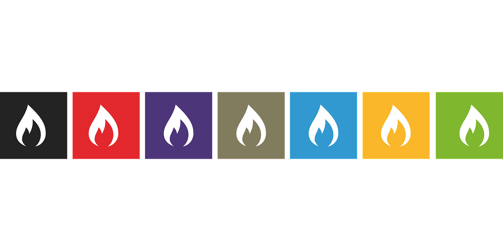

  

## Languages and Tools
### ◎ HTML, CSS (Sass/LESS)
### ◎ JavaScript (ES14)
### ◎ TypeScript
### ◎ Ruby
#### ◦ Frontend technologies (React/Vue/Next.js)
#### ◦ Backend technologies (Node.js/NestJS/Ruby on Rails)
#### ◦ Databases and web storage ( SQL/NoSQL - MongoDB, PostgreSQL)
#### ◦ Docker (AWS Fargate/Amazon ECS)
#### ◦ Git/GitHub
#### ◦ REST and SOAP
#### ◦ Web architectur

  

